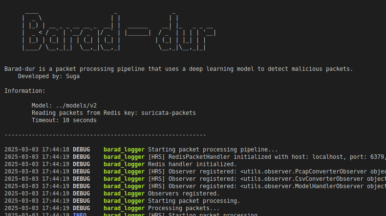

# Barad-dûr

**Barad-dûr** integrates a Deep Learning model into the open-source IDS [Suricata](https://suricata.io/), enabling autonomous network traffic monitoring.



The project provides a **Real-Time Detection** system and includes a Jupyter Notebook (`notebooks/main.ipynb`) for building the Deep Learning model.

---

## 📁 Repository Structure

- **`notebooks/`** – Contains notebooks for building the Deep Learning model and monitoring the system.
- **`models/`** – Stores created or imported models.
- **`src/`** – Source code for Barad-dûr.
- **`suricata_env/`** – Contains a custom configuration file for Suricata, IDS rules, and an example PCAP file.

---

## 🚀 Installation & Running

### 🔹 Prerequisites

Ensure you have installed:
1. **Suricata**
2. **Redis**
3. **Python 3.12**

### 🔹 Cloning the Repository

Clone the repository with all submodules:
```bash
  git clone --recurse-submodules https://github.com/jose-sgariglia/Barad-dur.git
```
If you've already cloned the project, update the submodules:
```bash
  cd Barad-dur
  git submodule update --init --recursive
```

### 🔹 Creating a Virtual Environment

To avoid dependency conflicts, create a Python virtual environment:

```bash
  python3 -m venv venv && source ./venv/bin/activate  
```

### 🔹 Installing Dependencies

Run the setup script to install all dependencies:

```bash
  sh ./setup.sh
```

## Running the Application

### 1️⃣ Configure Suricata
Before starting the project, modify the Suricata configuration file. You can use the one provided in `suricata_env/suricata.yaml`, which is preconfigured for Redis connectivity.

### 2️⃣ Start Barad-dûr
Launch the system with the following command:
```bash
  cd src
  python3 main.py -m model_folder
```
Replace _`model_folder`_ with the directory containing:
- The Deep Learning model.
- The feature set selected using NTLFlowLyzer.
- The output mapping.

For a complete list of options, run:
```bash
  cd src
  python3 main.py --help
```

## 🐳 Running with Docker
You can also run Barad-dûr in a Docker container.

### 🔹 Building the Docker Image

```bash
  docker build -t barad-dur .
```

### 🔹 Running the Docker Container

```bash
  docker run -it --network host barad-dur
```

Once inside the container, execute the source code:

``` bash
  cd src
  python3 main.py -m model_folder
```


---

## 🤝 Contributing

This project needs a helping hand to move forward! We welcome contributions, improvements, and suggestions from the community. For detailed guidelines on how to contribute, please refer to the [CONTRIBUTING.md](CONTRIBUTING.md) document.

All contributions, big or small, are greatly appreciated.

**Autore:** José Sgariglia (_Suga_)